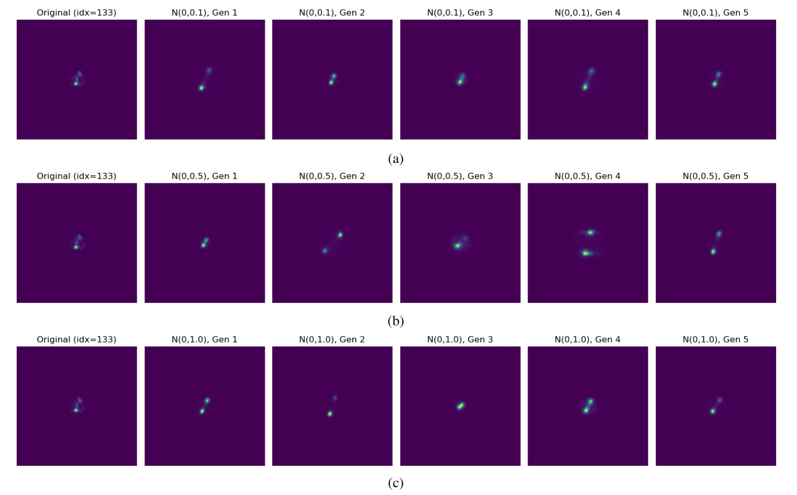
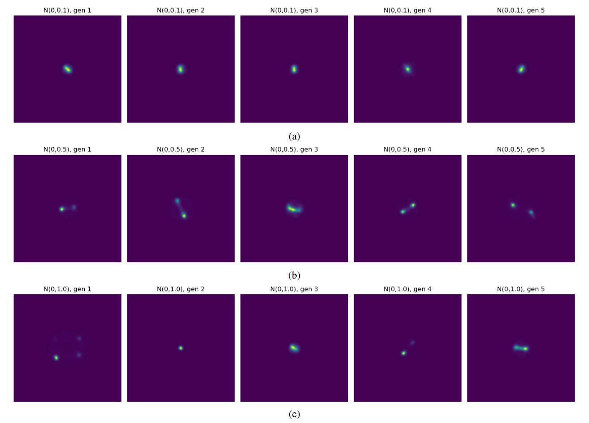
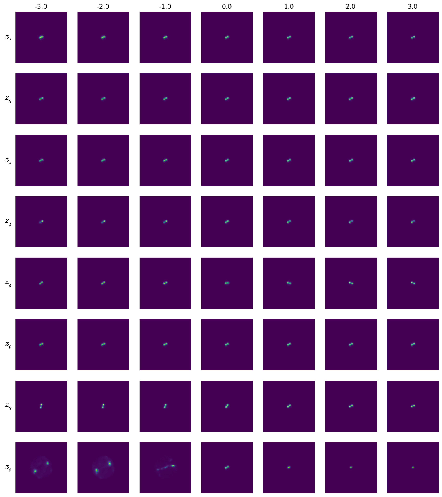

# Variational Views for Self-Supervised Learning in Radio Astronomy

[](https://arxiv.org/abs/2602.18923)
[-green)](https://arxiv.org/abs/2602.18923)
[](https://www.python.org/)
[](https://pytorch.org/)

**Johnny Joseph Alphonse & Anna M. M. Scaife**  
Jodrell Bank Centre for Astrophysics, University of Manchester

---

## Overview

Self-supervised learning (SSL) methods like BYOL rely on generating two augmented "views" of an input image to learn representations without labels. Standard augmentation pipelines use geometric and photometric transforms — but for radio galaxy morphology, these transforms may not produce physically meaningful or sufficiently diverse views.

This project investigates whether **β-Variational Autoencoders (β-VAEs)** can serve as a principled alternative view-generation mechanism for SSL in radio astronomy. The VAE learns the underlying morphological distribution of the training data and generates synthetic views by sampling from the latent space. These VAE-generated views are then used as inputs to a **BYOL** self-supervised learning framework to study morphological feature learning on radio galaxy data.

**Datasets:** [MiraBest](https://zenodo.org/record/4288837) and [Radio Galaxy Zoo (RGZ108k)](https://radio.galaxyzoo.org/)

---

## Paper

> **Variational views for self-supervised learning in radio astronomy**  
> Johnny Joseph Alphonse & Anna M. M. Scaife  
> *Under review at Royal Astronomical Society Techniques and Instruments (RASTI), 2025*  
> arXiv: [2602.18923](https://arxiv.org/abs/2602.18923)

---

## Repository Structure

```
b_VAE-for-RadioGalaxy-SSL/
│
├── BYOL/                          # Full BYOL SSL pipeline with VAE-generated views
│   ├── _data/
│   │   └── mb/                    # MiraBest data batches
│   │       ├── F_batches/
│   │       └── MiraBest_F_batches.tar.gz
│   │
│   ├── byol/                      # Outer BYOL folder
│   │   ├── byol/                  # Core BYOL implementation (Python package)
│   │   │   ├── init.py
│   │   │   ├── config.py          # Experiment configuration
│   │   │   ├── datamodules.py     # Data loading and view generation
│   │   │   ├── datasets.py        # Dataset classes
│   │   │   ├── evaluation.py      # Downstream evaluation (linear probe)
│   │   │   ├── finetuning.py      # Fine-tuning utilities
│   │   │   ├── models.py          # BYOL online/target network architecture
│   │   │   ├── paths.py           # Path management
│   │   │   ├── resnet.py          # ResNet encoder backbone
│   │   │   ├── run_eval.py        # Evaluation runner script
│   │   │   ├── train.py           # Main BYOL training loop
│   │   │   ├── utilities.py       # Helper functions
│   │   │   └── vae.py             # VAE model used for view generation within BYOL
│   │   │
│   │   └── config/                # YAML experiment configs
│   │       ├── global.yml         # Global settings
│   │       ├── rgz.yml            # RGZ dataset config
│   │       ├── rgz-optimal.yml    # Optimal RGZ hyperparameters
│   │       ├── finetune.yml       # Fine-tuning config
│   │       └── finetune_optimal.yml
│   │
│   ├── train.sh                   # SLURM job script for BYOL training
│   ├── finetune.sh                # SLURM job script for fine-tuning
│   └── eval.sh                    # SLURM job script for evaluation
│
├── figures/                       # Result visualisations
│   ├── reconstructions.jpg        # VAE reconstruction examples
│   ├── generations.jpg            # Prior samples from the trained VAE
│   └── LT_RGZ_23.png              # Latent traversal plots
│
├── MiraBest.py                    # MiraBest dataset loader
├── VAE_for_RGZData.py             # beta-VAE model training on RGZ108k
├── beta.sh                        # SLURM job script for beta search
├── beta_search.py                 # beta hyperparameter selection (see note below)
├── rgz_data_preds_filtered.csv    # Filtered RGZ predictions/labels
└── rgzvae.sh                      # SLURM job script for β-VAE training
```

---

## Method

**Stage 1 — β-VAE Training** (`VAE_for_RGZData.py`)

A convolutional β-VAE is trained on the RGZ108k dataset to learn a latent representation of radio galaxy morphology. KL annealing is used during training for stability. The β parameter controls the trade-off between reconstruction fidelity and latent space regularisation.

**Stage 2 — BYOL with VAE Views** (`BYOL/`)

The trained VAE is integrated into the BYOL framework as a view generator. Rather than standard image augmentations, the VAE generates morphology-aware synthetic views by sampling from the latent space. BYOL then learns representations by maximising agreement between these views, evaluated via a linear probe on downstream classification.

---

## Beta Selection

`beta_search.py` implements the disentanglement metric from Higgins et al. (2017). However, as noted in the paper and consistent with findings in the broader literature (see [arXiv:2112.14278](https://arxiv.org/abs/2112.14278)), this metric is known to produce inconsistent results across runs and datasets. It is therefore not used as a definitive selection criterion.

Instead, beta selection in this work relies on **latent traversal plots** as a qualitative diagnostic — inspecting how smoothly and interpretably each latent dimension encodes morphological variation across a range of beta values. This approach is discussed in the paper.

---

## Installation

```bash
git clone https://github.com/joe-johnny/b_VAE-for-RadioGalaxy-SSL.git
cd b_VAE-for-RadioGalaxy-SSL

pip install torch torchvision numpy scipy matplotlib pandas scikit-learn wandb tqdm
```

Place the RGZ108k dataset in `BYOL/_data/` and MiraBest data in `BYOL/_data/mb/`.

---

## Usage

1. Train the β-VAE on RGZ data using VAE_for_RGZDATA.py
2. Find the beta value using latent traversal figures and KL diagnostic plot
3. Run BYOL training with β-VAE-generated views using /BYOL/byol/byol/train.py
4. Evaluate representations using /BYOL/byol/byol/run_eval.py
5. Fine-tune and evaluate downstream using /BYOL/byol/byol/finetuning.py

---

## Results

Key results are reported in the accompanying paper ([arXiv:2602.18923](https://arxiv.org/abs/2602.18923)).

### Reconstructions

*Reconstructions of a RGZ radio source with  = 2.3. The original is shown at left in each row, followed by multiple stochastic reconstructions obtained by adding Gaussian noise to the latent code at increasing levels: (A) σ² = 0.1, (B) σ² = 0.5, (C) σ² = 1.0.*

### Generated Samples

*Synthetic samples from the latent space of a β-VAE trained on the Radio Galaxy Zoo dataset with β = 2.3. Each row shows generations obtained by adding Gaussian noise to the latent code at increasing levels: (A) σ² = 0.1, (B) σ² = 0.5, (C) σ² = 1.0.*

### Latent Traversals

*Latent traversal map showing all 8 dimensions with disentangled factors in RGZ data using β-VAE with β = 2.3.*

---

## Citation

```bibtex
@misc{alphonse2026variationalviewsselfsupervisedlearning,
      title={Variational views for self-supervised learning in radio astronomy}, 
      author={Johnny Joseph Alphonse and Anna M. M. Scaife},
      year={2026},
      eprint={2602.18923},
      archivePrefix={arXiv},
      primaryClass={astro-ph.IM},
      url={https://arxiv.org/abs/2602.18923}, 
}
```

---

## Contact

**Johnny Joseph Alphonse**  
joe27johnny@gmail.com  
[LinkedIn](https://www.linkedin.com/in/joe-johnny/) | [ORCID](https://orcid.org/0009-0001-7829-6636) | [arXiv](https://arxiv.org/abs/2602.18923)
